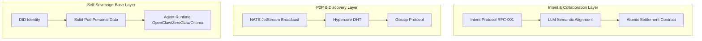

# System Architecture

## 0. Design Premises & Positioning

### 0.1 Design Premises

- **Compute is cheap**: Assume inference cost is acceptable; no extreme optimization at this layer
- **Each user has an Agent**: Consumers, merchants, riders each run their own AI Agent; no reliance on centralized platforms

### 0.2 Positioning: Protocol Layer, Not Agent Runtime

| Layer | Open-A2A | OpenClaw / ZeroClaw etc. |
|-------|----------|---------------------------|
| Role | Define how Agents communicate (intent, offer, topics) | Provide Agent inference, tools, multimodal capabilities |
| Output | Protocol specs, message format, NATS topics | Runnable AI assistant |
| Analogy | TCP/IP protocol | Browser / application |

**Open-A2A does not implement core AI functionality**. It integrates with mature Agent runtimes such as [OpenClaw](https://github.com/openclaw/openclaw) and [ZeroClaw](https://github.com/zeroclaw-labs/zeroclaw), which provide natural language understanding, decision-making, and tool-calling.

---

## 1. Core Architecture: Three-Tier Mesh

To achieve seamless auto-collaboration like "ordering noodles", the architecture is split into three layers:

| Layer | Name | Responsibility |
|-------|------|----------------|
| **L1** | Self-Sovereign Base | Identity, data sovereignty, local AI execution |
| **L2** | P2P & Discovery | Intent broadcast, node discovery, message propagation |
| **L3** | Intent & Collaboration | Semantic alignment, negotiation, atomic settlement |

---

## 2. Tech Stack Implementation Guide

### 2.1 Identity & Data (Digital Pod) — "Who am I, what do I like?"

- **Implemented**: `open_a2a/identity.py` ([didlite](https://github.com/jondepalma/didlite-pkg)), `open_a2a/preferences.py` (`FilePreferencesProvider`, `SolidPodPreferencesProvider`)
- **DID Binding**: `AgentIdentity` generates `did:key`; optional JWS signing (`USE_IDENTITY=1`)
- **Preference Storage**: `FilePreferencesProvider` from `profile.json`; `SolidPodPreferencesProvider` from **self-hosted** Solid Pod (**recommended**, data sovereignty, `pip install open-a2a[solid]`)
- **Next**: SpruceID, VC for minimal permissions; client credentials auth

### 2.2 Discovery & Broadcast (Intent Mesh) — "Where are noodles, who can deliver?"

- **Transport**: `TransportAdapter` (`open_a2a/transport.py`); implemented: `NatsTransportAdapter`, `RelayClientTransport` (outbound-first, [RFC-003](../../spec/rfc-003-relay-transport.md))
- **Discovery**: `DiscoveryProvider` (`open_a2a/discovery.py`); implemented: `NatsDiscoveryProvider` (same NATS/cluster), `DhtDiscoveryProvider` (cross-network, env `OPEN_A2A_DHT_BOOTSTRAP`); multi-cluster: [10-nats-cluster-federation](../zh/10-nats-cluster-federation.md). See [06-progress](./06-progress.md).
- **Tools**: NATS.io, Kademlia DHT (optional), Relay (WebSocket↔NATS)
- **Tasks**:
  - **Intent Publish**: Agent publishes to NATS `intent.{domain}.{action}` (e.g. `intent.food.order`)
  - **Capability Subscribe**: Agents with capability subscribe and respond
  - **Geo-fencing**: DHT or local cache so intent reaches relevant parties only

### 2.3 Semantic Negotiation (AI Dialogue) — "Dietary restrictions, price, time"

- **Tools**: `MCP (Model Context Protocol)` + `JSON-LD`
- **Tasks**:
  - **Semantic Handshake**: Merchant Agent exposes "menu query tool" via MCP
  - **LLM Auto-Negotiation**: Multi-round private dialogue; A: "Spicy?" B: "No spice, 15"
  - **Contract Generation**: After agreement, generate temporary JSON with signatures and delivery terms

### 2.4 Integration with Agent Runtimes

Open-A2A as a **protocol layer** integrates with Agent runtimes via:

| Integration | Description | Use Case |
|-------------|-------------|----------|
| **Tool / Skill** | Expose Open-A2A as an Agent-callable tool | User says "want noodles" → Agent calls tool to publish intent |
| **Channel** | Similar to OpenClaw's WhatsApp/Telegram channels | Agent subscribes to intent topics, decides whether to respond |
| **Bridge** | Adapter connecting Open-A2A SDK to Agent runtime | Runtime need not know NATS details |

**Recommended integration targets**:

- [OpenClaw](https://github.com/openclaw/openclaw): Personal AI assistant, multi-channel (WhatsApp, Telegram, etc.), TypeScript, has `sessions_*` tools for Agent-to-Agent
- [ZeroClaw](https://github.com/zeroclaw-labs/zeroclaw): Lightweight Rust runtime (<5MB RAM), trait-driven, pluggable Provider/Channel/Tool

---

### 2.5 Settlement & Delivery (Value Flow) — "No platform cut"

- **Tools**: `HTLC` + `Lightning Network/L2`
- **Tasks**:
  - **Tri-party Contract**: Joint signature between B (merchant) and C (rider)
  - **Atomic Settlement**: When C scans A's QR (Proof of Delivery), smart contract triggers, funds split with zero fee
