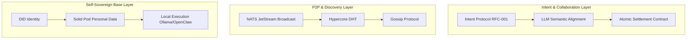

# System Architecture

## 1. Core Architecture: Three-Tier Mesh

To achieve seamless auto-collaboration like "ordering noodles", the architecture is split into three layers:

| Layer | Name | Responsibility |
|-------|------|----------------|
| **L1** | Self-Sovereign Base | Identity, data sovereignty, local AI execution |
| **L2** | P2P & Discovery | Intent broadcast, node discovery, message propagation |
| **L3** | Intent & Collaboration | Semantic alignment, negotiation, atomic settlement |

---

## 2. Tech Stack Implementation Guide

### 2.1 Identity & Data (Digital Pod) — "Who am I, what do I like?"

- **Tools**: `SpruceID` (DID) + `Community Solid Server` (Pod)
- **Tasks**:
  - **DID Binding**: Each Agent generates a `did:key` on startup
  - **Preference Storage**: Store `profile.jsonld` in Solid Pod (e.g., `"dislike": ["coriander"]`)
  - **Minimal Permissions**: Agent proves "I can pay" via VC, without exposing card numbers

### 2.2 Discovery & Broadcast (Intent Mesh) — "Where are noodles, who can deliver?"

- **Tools**: `NATS.io` + `Hypercore`
- **Tasks**:
  - **Intent Publish**: Consumer Agent publishes Protobuf to NATS `intent.food.*`
  - **Capability Subscribe**: All noodle shop Agents subscribe
  - **Geo-fencing**: Hypercore maintains nearby node cache so "want noodles" doesn't reach shops 1000 km away

### 2.3 Semantic Negotiation (AI Dialogue) — "Dietary restrictions, price, time"

- **Tools**: `MCP (Model Context Protocol)` + `JSON-LD`
- **Tasks**:
  - **Semantic Handshake**: Merchant Agent exposes "menu query tool" via MCP
  - **LLM Auto-Negotiation**: Multi-round private dialogue; A: "Spicy?" B: "No spice, 15"
  - **Contract Generation**: After agreement, generate temporary JSON with signatures and delivery terms

### 2.4 Settlement & Delivery (Value Flow) — "No platform cut"

- **Tools**: `HTLC` + `Lightning Network/L2`
- **Tasks**:
  - **Tri-party Contract**: Joint signature between B (merchant) and C (rider)
  - **Atomic Settlement**: When C scans A's QR (Proof of Delivery), smart contract triggers, funds split with zero fee
