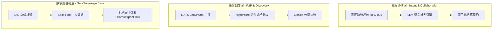

# 系统架构

## 1. 核心架构：三层智能网格 (The Three-Tier Mesh)

为了实现「面条订单」那种无感知的自动协作，架构分为三层：

| 层级 | 名称 | 核心职责 |
|------|------|----------|
| **L1** | 数字舱基础层 | 身份、数据主权、本地 AI 执行 |
| **L2** | 通信调度层 | 意图广播、节点发现、消息传播 |
| **L3** | 意图协作层 | 语义对齐、协商、原子结算 |

---

## 2. 技术栈实现指南

### 2.1 身份与数据（数字舱）— 解决「我是谁，我爱吃什么」

- **核心工具**：`SpruceID` (DID) + `Community Solid Server` (Pod)
- **开发任务**：
  - **DID 绑定**：每个 Agent 启动时生成一个 `did:key`
  - **偏好存储**：在 Solid Pod 中存入 `profile.jsonld`，描述用户口味（如：`"dislike": ["coriander"]`）
  - **权限最小化**：Agent 只能通过 VC（可验证凭证）向商家证明「我有钱支付」，而不需要暴露银行卡号

### 2.2 发现与广播（意图网格）— 解决「面条在哪，谁能送」

- **核心工具**：`NATS.io` + `Hypercore`
- **开发任务**：
  - **意图广播 (Publish)**：消费者 Agent 向 NATS 的 `intent.food.*` 主题发布 Protobuf 消息
  - **能力监听 (Subscribe)**：所有面馆 Agent 订阅该主题
  - **地理围栏过滤**：利用 Hypercore 维护附近节点缓存，确保「想吃面」不会被千里之外的面馆收到

### 2.3 语义协商（AI 对话）— 解决「忌口、价格与时间」

- **核心工具**：`MCP (Model Context Protocol)` + `JSON-LD`
- **开发任务**：
  - **语义握手**：商家 Agent 收到意图后，通过 MCP 暴露「菜单查询工具」
  - **LLM 自动博弈**：双方 Agent 启动多轮私密对话，A 问：「加辣吗？」 B 答：「不加辣 15 元」
  - **合同生成**：协商达成后，生成包含双方签名和交付条件的临时 JSON 对象

### 2.4 结算与交付（价值流）— 解决「去平台抽成」

- **核心工具**：`HTLC (哈希时间锁定合约)` + `闪电网络/L2`
- **开发任务**：
  - **三方契约**：建立 B(商家) 与 C(骑手) 的联合签名机制
  - **原子结算**：C 扫描 A 的二维码（Proof of Delivery）时，触发智能合约，资金瞬间 0 手续费分配
