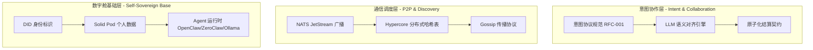

# 系统架构

> 设计原则见 [00-design-principles.md](./00-design-principles.md)。架构服务于「跨网络 Agent 通信」与「数据交互形式/逻辑」，送餐仅为示例场景。

---

## 0. 设计前提与定位

### 0.1 设计前提

- **算力便宜**：假设推理成本可接受，不在此层面做极致优化
- **每用户拥有 Agent**：各参与方运行自己的 AI Agent，不依赖中心化平台

### 0.2 项目定位：协议层，非 Agent 运行时

| 层级 | Open-A2A | OpenClaw / ZeroClaw 等 |
|------|----------|------------------------|
| 职责 | 定义 Agent 间如何通信（意图、报价、主题） | 提供 Agent 的推理、工具、多模态能力 |
| 产出 | 协议规范、消息格式、NATS 主题 | 可运行的 AI 助手 |
| 类比 | TCP/IP 协议 | 浏览器 / 应用程序 |

**Open-A2A 不实现核心 AI 功能**，而是与成熟的 Agent 运行时（如 [OpenClaw](https://github.com/openclaw/openclaw)、[ZeroClaw](https://github.com/zeroclaw-labs/zeroclaw)）集成，由它们提供自然语言理解、决策、工具调用等能力。

---

## 1. 核心架构：三层智能网格 (The Three-Tier Mesh)

为实现 Agent 间无感知的自动协作（示例：意图广播 → 多方响应 → 协商确认 → 子任务委托），架构分为三层：

| 层级 | 名称 | 核心职责 |
|------|------|----------|
| **L1** | 数字舱基础层 | 身份、数据主权、本地 AI 执行 |
| **L2** | 通信调度层 | 意图广播、节点发现、消息传播 |
| **L3** | 意图协作层 | 语义对齐、协商、原子结算 |

---

## 2. 技术栈实现指南

### 2.1 身份与数据（数字舱）— 解决「我是谁，我的偏好」

- **已实现**：`open_a2a/identity.py`（基于 [didlite](https://github.com/jondepalma/didlite-pkg)）、`open_a2a/preferences.py`（`FilePreferencesProvider`、`SolidPodPreferencesProvider`）
- **DID 绑定**：`AgentIdentity` 生成 `did:key`，消息可选 JWS 签名（`USE_IDENTITY=1` 启用）
- **偏好存储**：`FilePreferencesProvider` 从 `profile.json` 读取；`SolidPodPreferencesProvider` 从**自托管** Solid Pod 读取（**推荐**，符合数据主权，`pip install open-a2a[solid]`）
- **后续**：SpruceID、VC 用于权限最小化；客户端凭证认证

### 2.2 发现与广播（意图网格）— 解决「谁在附近，谁能响应」

- **传输层抽象**：`TransportAdapter` 接口（`open_a2a/transport.py`），已实现 `NatsTransportAdapter`、`RelayClientTransport`（出站优先，见 [RFC-003](../../spec/rfc-003-relay-transport.md)）；可扩展 HTTP、WebSocket、P2P
- **Agent 发现**：`DiscoveryProvider` 接口（`open_a2a/discovery.py`），已实现：
  - **NATS 发现**：`NatsDiscoveryProvider`（同 NATS/集群内能力注册与查询，主题 `open_a2a.discovery.query.{capability}`）
  - **DHT 发现**：`DhtDiscoveryProvider`（跨网络、无中心索引，见 [06-progress](./06-progress.md)#DHT 发现后端）；支持环境变量 `OPEN_A2A_DHT_BOOTSTRAP` 与公共 bootstrap 列表
  - **多 NATS 集群**：见 [10-nats-cluster-federation.md](./10-nats-cluster-federation.md)
- **核心工具**：`NATS.io`、Kademlia DHT（可选）、Relay（WebSocket↔NATS）
- **开发任务**：
  - **意图广播 (Publish)**：Agent 向 `intent.{domain}.{action}` 主题发布消息（示例：`intent.food.order`）
  - **能力监听 (Subscribe)**：具备能力的 Agent 订阅对应主题并响应
  - **地理/语义过滤**：利用 DHT 或本地缓存，确保意图被相关方接收，避免无关干扰

#### 2.2.1 「分布式」但不是区块链

Open-A2A 所说的「分布式」，指的是**消息路由与多运营者节点**，而不是「全网共识账本」：

- 每个 NATS / Relay / Bridge 节点由不同的运营者运行（你、社区、公司等）；
- 节点之间可以：
  - 共享一个 NATS 集群（共同的主题空间）；或
  - 保持各自独立的 NATS，通过联邦/桥接有选择地同步部分主题（见 [10-nats-cluster-federation.md](./10-nats-cluster-federation.md)）。
- Open-A2A **不维护全球不可篡改状态**，也没有共识层；Intent / Offer / Logistics 等消息是跨节点流动的事件，而非链上交易。

更接近的类比是「邮件服务器 / XMPP 联邦」，而非区块链。若某些场景需要强一致结算，可在 L3 上接入外部结算系统（链上或链下），而不强绑定在 Open-A2A 协议中。

### 2.3 语义协商（AI 对话）— 解决「约束、条件与共识」

- **核心工具**：`MCP (Model Context Protocol)` + `JSON-LD`
- **开发任务**：
  - **语义握手**：响应方 Agent 收到意图后，通过 MCP 暴露相关能力（示例：菜单查询、库存检查）
  - **LLM 自动博弈**：双方 Agent 多轮私密对话，就约束、条件、价格等达成共识
  - **合同生成**：协商达成后，生成包含双方签名和交付条件的临时 JSON 对象

### 2.4 与 Agent 运行时的集成

Open-A2A 作为**协议层**，通过以下方式与 Agent 运行时集成：

| 集成方式 | 说明 | 适用场景 |
|----------|------|----------|
| **Tool / Skill** | 将 Open-A2A 封装为 Agent 可调用的工具 | 用户表达意图 → Agent 调用工具发布到网络 |
| **Channel** | 类似 OpenClaw 的 WhatsApp/Telegram 通道 | Agent 订阅意图主题，收到后决策是否响应 |
| **Bridge** | 适配层连接 Open-A2A SDK 与 Agent 运行时 | 运行时无需关心 NATS 细节 |

**推荐集成目标**：

- [OpenClaw](https://github.com/openclaw/openclaw)：个人 AI 助手，多通道（WhatsApp、Telegram 等），TypeScript，已有 `sessions_*` 等 Agent 间工具
- [ZeroClaw](https://github.com/zeroclaw-labs/zeroclaw)：轻量 Rust 运行时（<5MB RAM），Trait 驱动，Provider/Channel/Tool 可插拔

---

### 2.5 结算与交付（价值流）— 解决「去平台抽成」

- **核心工具**：`HTLC (哈希时间锁定合约)` + `闪电网络/L2`
- **开发任务**：
  - **多方契约**：建立参与方（示例：B 与 C）的联合签名机制
  - **原子结算**：交付证明触发时，智能合约瞬间分配价值，无中间商抽成
