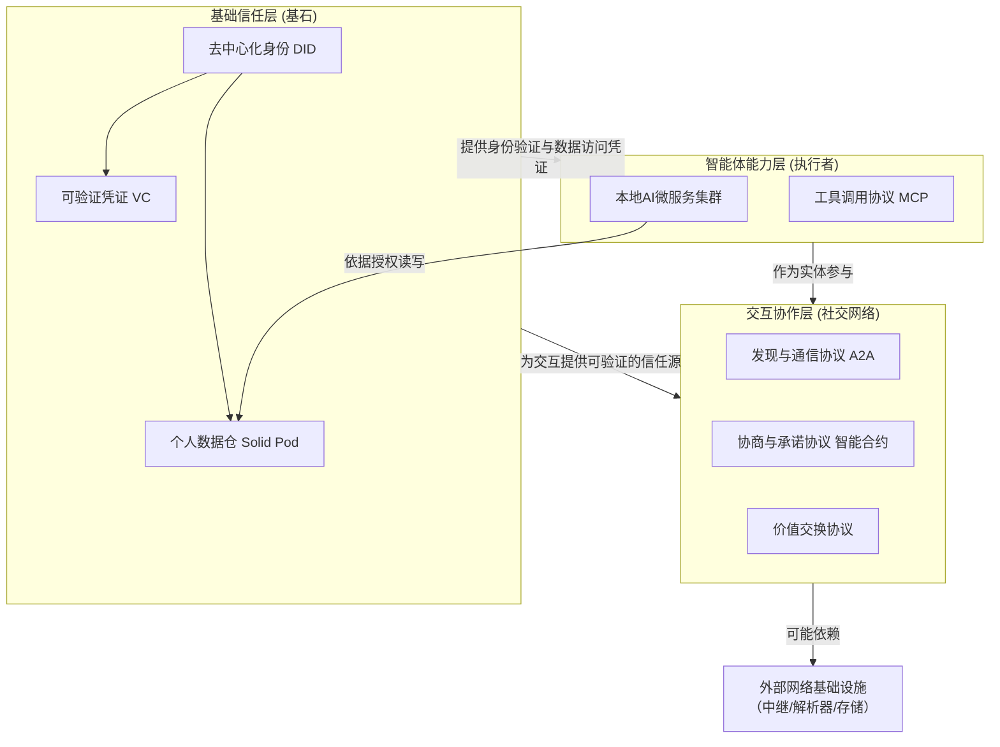

# 归档：关于构建去中心化个人 AI 智能体协作网络的技术咨询文档

> 本文档为早期技术咨询文档，已归档至 `reference/` 目录。当前架构与需求请参阅主文档。

---

## 1. 文档目的与背景

本文档旨在系统阐述一个关于未来去中心化数字生态的构想，并就该构想中涉及的核心技术可行性、协议路径与实施挑战，向各位专家寻求深度咨询与指导。

构想的出发点是：在 Web3、自主身份（Self-Sovereign Identity）和边缘计算等趋势下，未来每个个体是否可能拥有一个由自己完全掌控的「个人数字舱」（即本地微服务器）。该数字舱不仅存储个人数据（遵循 Solid 理念），还运行着代表个人行事的 AI 智能体（如 OpenClaw）。本构想的核心挑战与探索焦点在于：**这些分布在不同个人服务器上的、异构的 AI 智能体，如何能够在不依赖中心化平台的情况下，安全、可信、高效地直接交互与协作？**

---

## 2. 核心问题与当前困境

1. **交互寻址问题**：每个 AI 智能体需要一个全球唯一且不受单一机构控制的「身份」和「地址」
2. **交互协议问题**：智能体间的交互涉及发现、认证、协商、任务协作、价值转移等多个复杂阶段
3. **基础设施依赖问题**：为实现可靠的网络连接（尤其在 NAT 和防火墙后），如何依赖第三方中继服务？
4. **信任建立问题**：在无中心平台背书的情况下，两个陌生智能体如何快速建立信任？

---

## 3. 构想解决方案：分层协议栈框架

### 3.1 整体架构图示

### 3.2 典型交互流程

1. **发现**：A 通过 DID 网络或分布式索引发现 B，获取其 DID 文档
2. **连接与认证**：A 与 B 建立安全连接，双方交换并验证 DID
3. **需求与授权协商**：A 提出需求，B 要求 VC，A 从 Pod 生成并发送
4. **业务协商与缔约**：双方谈判，共识写入智能合约，双方签名
5. **执行与结算**：B 执行服务，交付证明写入合约，A 确认后触发支付

---

## 4. 对核心问题的解析与解决方案

| 核心问题 | 传统方案 | 本构想方案 | 关键变化 |
|----------|----------|------------|----------|
| 交互寻址 | 中心化域名（DNS） | 去中心化身份标识符（DID） | 从「位置寻址」转向「身份寻址」 |
| 交互协议 | HTTPS | 分层、组合式协议栈 | 从单一通信转向社会协作协议 |
| 基础设施 | 中心化服务器与 CDN | 点对点优先，去中心化中继 | 中继不掌控身份、不窥探数据 |
| 信任建立 | CA 证书与平台信誉 | VC 与智能合约 | 信任转为可数学验证 |

---

## 5. 技术现状与可行性评估

### 5.1 已存在的积极要素

- W3C 的 DID、VC 标准已确立；Solid 协议有开源实现；MCP、A2A 等协议快速发展
- 非对称加密、P2P 网络、分布式账本、零知识证明等技术较成熟
- Web3、隐私计算、AI Agent 等领域需求强烈，开源社区活跃

### 5.2 面临的主要挑战与缺口

- 协议栈的整合与互操作性
- 语义理解的标准化（瓶颈）
- 大规模系统的治理与协调
- 用户体验与密钥管理
- 网络基础设施的过渡

---

## 6. 寻求专家咨询的核心要点

1. 技术可行性判断
2. 协议与标准选型（A2A、DID 方法）
3. 实施路径建议（技术栈组合、开发路线图）
4. 风险与障碍评估
5. 生态与协作机会

---

*文档整理与技术支持：基于与 AI 助手的深度讨论生成。*
